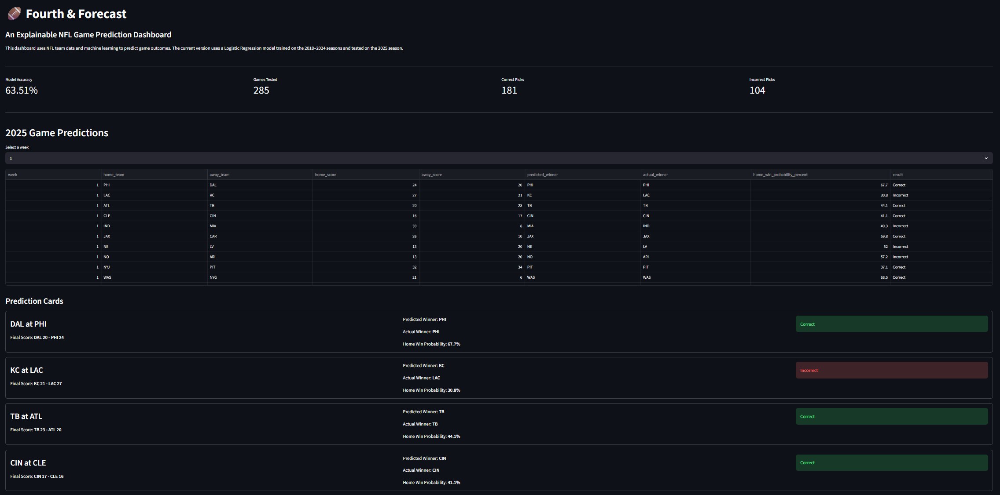
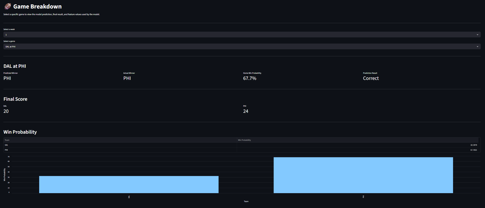
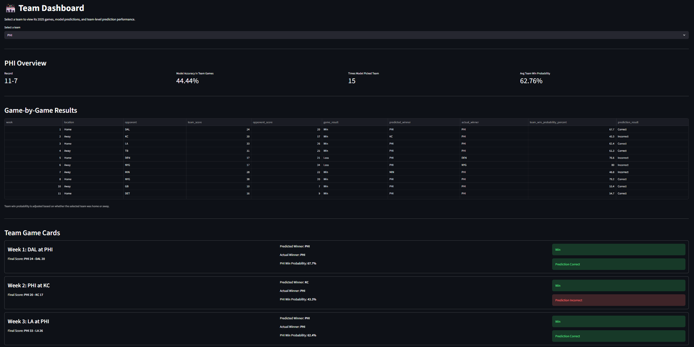
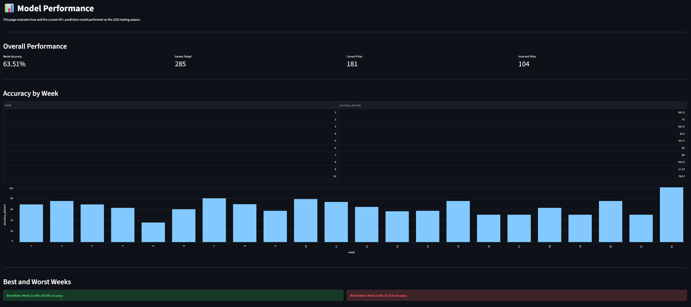
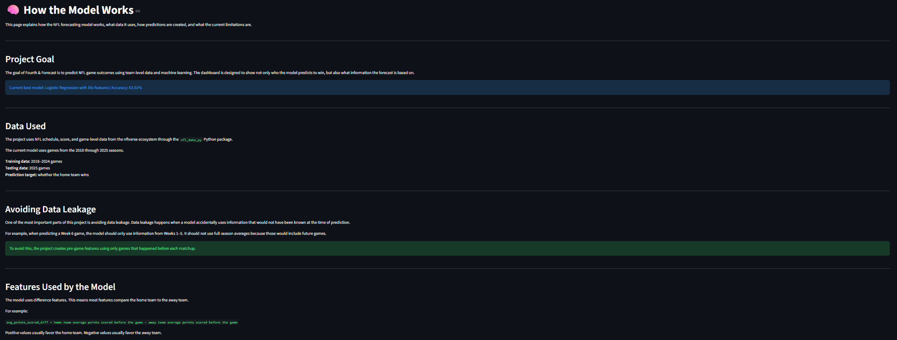

# Fourth & Forecast: NFL Game Prediction Dashboard

Fourth & Forecast is an NFL forecasting dashboard that predicts game outcomes using team-level statistics, Elo ratings, and machine learning.

The goal of this project is to create an explainable sports analytics dashboard that shows not only which team is predicted to win, but also what information the model used to make that prediction.

## Live Dashboard

View the live Streamlit dashboard here:

[Fourth & Forecast Dashboard](https://nfl-forecasting-dashboard-bmigza2zszwnqz4rohkbzn.streamlit.app/)

## Current Status

This project currently has a working Streamlit dashboard with multiple pages for exploring model predictions, team performance, game breakdowns, and model accuracy.

Current best model:

| Model | Training Data | Testing Data | Accuracy |
|---|---|---|---:|
| Logistic Regression with Elo features | 2018–2024 NFL seasons | 2025 NFL season | 63.51% |

## Project Goals

The main goals of this project are to:

- Predict NFL game winners using historical team data
- Create an interactive dashboard for viewing predictions
- Explain how each forecast is calculated
- Track model performance over time
- Build a strong end-to-end data science portfolio project
- Continue improving the model as better features and new data become available

## Dashboard Pages

The Streamlit dashboard currently includes the following pages:

### Home

The homepage shows:

- Current model accuracy
- Link/overview for 2026 upcoming forecasts
- Dashboard section guide
- Total games tested
- Correct and incorrect picks
- Weekly model evaluation prediction table
- Prediction cards for each game
- Model details and features used
- Forecast Hub summary cards
- Projected Super Bowl champion
- Top projected team
- Closest projected game
- Largest projected margin game

### Game Breakdown

The Game Breakdown page allows users to select a specific matchup and view:

- Predicted winner
- Actual winner
- Home win probability
- Final score
- Feature values used by the model
- Elo rating summary
- Win probability chart

### Team Dashboard

The Team Dashboard page allows users to select a team and view:

- Team record
- Model accuracy for that team’s games
- Number of times the model picked that team
- Average team win probability
- Game-by-game results
- Team win probability by week

### Model Performance

The Model Performance page shows:

- Overall model accuracy
- Accuracy by week
- Best and worst weeks
- Accuracy by confidence level
- Full prediction results

### Model Comparison

The Model Comparison page shows:

- Accuracy results from each model experiment
- Current best model
- Why Logistic Regression with Elo was selected
- Comparison of Logistic Regression, Random Forest, and Gradient Boosting
- Future modeling improvements

### How the Model Works

This page explains the project in plain English, including:

- Data used
- How data leakage is avoided
- Features used by the model
- What Elo means
- What strength of schedule means
- How Logistic Regression works
- How upcoming forecasts are created
- How predicted margin works
- How projected records are calculated
- How win probability should be interpreted
- Current limitations
- Future improvements

### Upcoming Forecasts

The Upcoming Forecasts page shows:

- 2026 scheduled game predictions
- Predicted winners
- Home and away win probabilities
- Projected margin of victory
- Projected team records
- Expected team records based on win probabilities
- Projected division standings
- Projected conference standings
- Forecast last updated metadata
- Predicted margin of victory using a Random Forest Regressor
- Projected playoff seeds
- Projected playoff bracket
- Projected Super Bowl matchup and champion

## Dashboard Preview

### Home



### Game Breakdown



### Team Dashboard



### Model Performance



### How the Model Works



## Data

The project uses NFL data from the nflverse ecosystem through the `nfl_data_py` Python package.

The current dataset includes games from the 2018 through 2025 NFL seasons.

Data used includes:

- Season
- Week
- Game ID
- Game date
- Home team
- Away team
- Home score
- Away score
- Game result
- Team scoring statistics
- Recent team performance
- Elo ratings

## Modeling Approach

The current best model is Logistic Regression with Elo features.

The model predicts whether the home team wins.

The target variable is:

```text
home_team_won
```

Where:

```text
1 = home team won
0 = home team lost
```

The dashboard uses two model types:

- Logistic Regression for win probability
- Random Forest Regressor for projected margin of victory

The margin model had an MAE of 10.28 points when tested on the 2025 season.


## Features Used

The current best model uses the following feature groups.

### Season-Long Pregame Features

- Average points scored difference
- Average points allowed difference
- Average point differential difference
- Win percentage difference

### Recent-Form Features

- Last 3 games average points scored difference
- Last 3 games average points allowed difference
- Last 3 games average point differential difference
- Last 3 games win percentage difference

### Elo Features

- Elo rating difference
- Elo rating difference with home-field advantage
- Elo-based home win probability

## What Elo Means

Elo is a team-strength rating system.

Each team starts with a base rating. After each game, ratings are updated based on the result.

A team gains Elo points when it wins and loses Elo points when it loses. The size of the rating change depends on how surprising the result was.

For example:

- If a strong team beats a weak team, the Elo change is small.
- If a weak team upsets a strong team, the Elo change is larger.

Current Elo settings:

| Setting | Value |
|---|---:|
| Base Elo | 1500 |
| K-factor | 20 |
| Home-field advantage | 55 Elo points |

Adding Elo improved model accuracy from 62.46% to 63.51%.

## Model Accuracy History

| Model Version | Accuracy |
|---|---:|
| Baseline random split | 59.35% |
| Season-based split | 61.40% |
| Recent-form features | 61.40% |
| Expanded training data | 62.46% |
| EPA features | 61.40% |
| Model comparison best | 62.46% |
| Elo features | 63.51% |

The current best model is Logistic Regression with Elo features.

## Project Structure

```text
NFL-Forecasting-Dashboard/
│
├── Home.py
├── requirements.txt
├── README.md
│
├── data/
│   ├── raw/
│   ├── processed/
│   └── predictions/
│
├── docs/
│   ├── project_plan.md
│   ├── data_dictionary.md
│   ├── modeling_notes.md
│   └── update_log.md
│
├── notebooks/
│   ├── 01_data_exploration.ipynb
│   ├── 02_feature_engineering.ipynb
│   ├── 03_model_testing.ipynb
│   ├── 04_model_improvement.ipynb
│   ├── 05_recent_form_features.ipynb
│   ├── 06_expand_training_data.ipynb
│   ├── 07_epa_features.ipynb
│   ├── 08_compare_models.ipynb
│   └── 09_elo_features.ipynb
│
├── pages/
│   ├── 1_Game_Breakdown.py
│   ├── 2_Team_Dashboard.py
│   ├── 3_Model_Performance.py
│   ├── 4_Model_Comparison.py
│   ├── 5_How_The_Model_Works.py
│   └── 6_Upcoming_Forecasts.py
│
└── src/
    └── train_model.py
```

## Notebooks

The project includes several notebooks that document the modeling process.

| Notebook | Purpose |
|---|---|
| `01_data_exploration.ipynb` | Explore NFL schedule and results data |
| `02_feature_engineering.ipynb` | Create first pregame features |
| `03_model_testing.ipynb` | Train first baseline model |
| `04_model_improvement.ipynb` | Test season-based train/test split |
| `05_recent_form_features.ipynb` | Add last-3-game recent form features |
| `06_expand_training_data.ipynb` | Expand training data to 2018–2025 |
| `07_epa_features.ipynb` | Test EPA-based features |
| `08_compare_models.ipynb` | Compare Logistic Regression, Random Forest, and Gradient Boosting |
| `09_elo_features.ipynb` | Add Elo rating features |

## Deployment Notes

The Streamlit dashboard uses processed data and prediction files stored in the repository.

Important app data files include:

- `data/predictions/best_logistic_regression_predictions.csv`
- `data/processed/game_results_2018_2025.csv`

The app entry point is:

```text
Home.py
```

For local use, run:

```bash
streamlit run Home.py
```

For deployment on Streamlit Community Cloud, use `Home.py` as the main file path.

## Updating Forecasts

During the NFL season, forecasts can be refreshed by running:

```bash
python src/predict_upcoming.py
```

This updates upcoming game predictions, projected records, and forecast metadata.

For the full weekly update process, see:

```text
docs/update_process.md
```

## Deployment Readiness Checklist

Before deploying, make sure the following items are complete:

- `requirements.txt` includes all needed Python packages.
- `Home.py` is the Streamlit entry file.
- Processed data files are included in the repository.
- Prediction files are included in the repository.
- The app runs locally with `streamlit run Home.py`.
- The README includes clear setup and run instructions.
- The dashboard pages load without missing file errors.

## Files Needed by the App

The dashboard depends on saved processed data and prediction files.

Main files used by the app:

```text
data/predictions/best_logistic_regression_predictions.csv
data/processed/game_results_2018_2025.csv
```

Additional processed files may also be used by notebooks or future model updates.

Raw data files are ignored because they can be larger and can be recreated from the data loading scripts.

## How to Run the Project Locally

### 1. Clone the repository

```bash
git clone https://github.com/caleb259/NFL-Forecasting-Dashboard.git
cd NFL-Forecasting-Dashboard
```

### 2. Create a virtual environment

On Windows:

```bash
python -m venv .venv
.venv\Scripts\activate
```

### 3. Install requirements

```bash
pip install -r requirements.txt
```

### 4. Train the model

```bash
python src/train_model.py
```

This creates the prediction file used by the dashboard:

```text
data/predictions/best_logistic_regression_predictions.csv
```

### 5. Run the Streamlit app

```bash
streamlit run Home.py
```

## Current Limitations

The current model is useful, but it is still an early version.

Current limitations include:

- The model does not include player injuries.
- The model does not include weather.
- The model does not include betting market information.
- The model does not predict final score.
- The model does not predict point spread.
- The model uses team-level data instead of player-level data.
- The dashboard currently evaluates completed 2025 games instead of live future games.

## Future Improvements

Planned future improvements include:

- Predict upcoming games for the next NFL season
- Add automated weekly data updates
- Add stronger EPA and success-rate features
- Add injury data
- Add weather data
- Add betting spread comparison
- Predict point margin
- Add team logos and team colors
- Improve dashboard styling
- Deploy the dashboard publicly

## Author

Created by Caleb Linsenbardt.